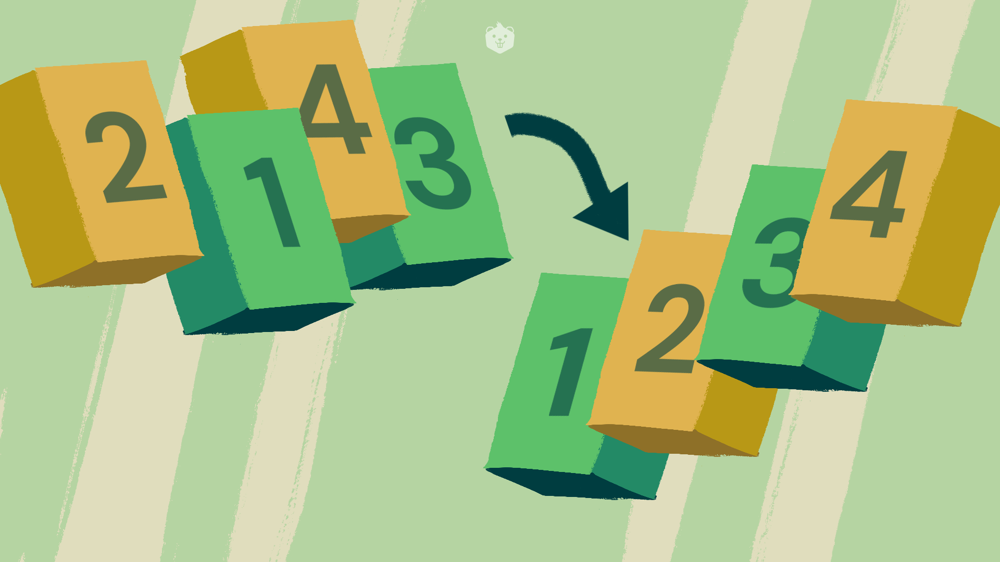
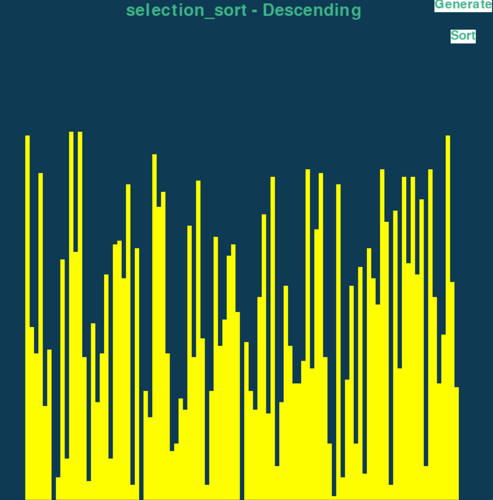
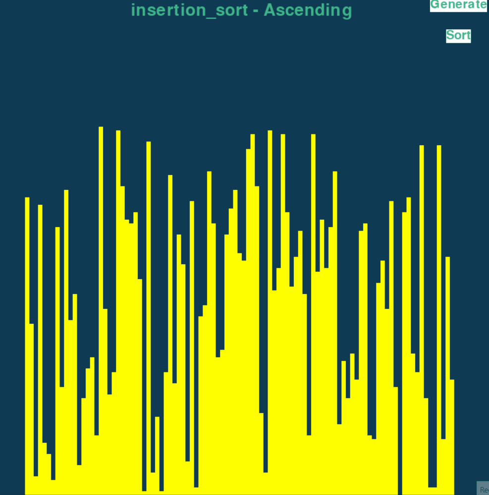
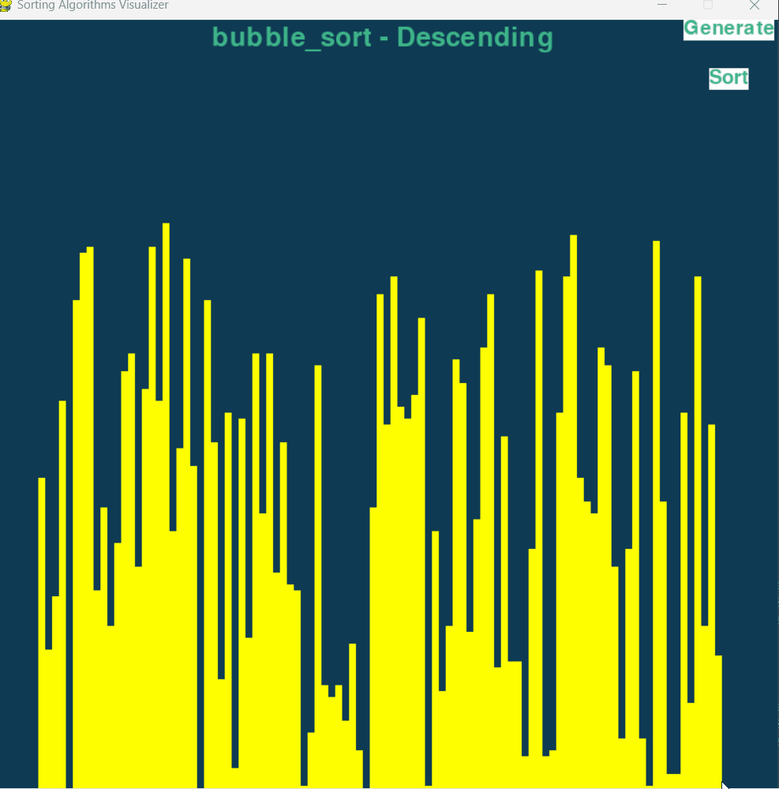
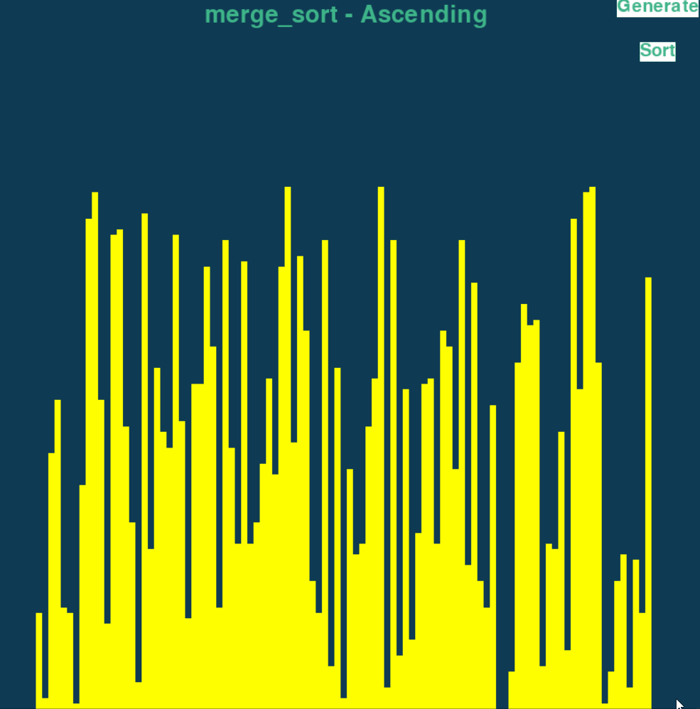
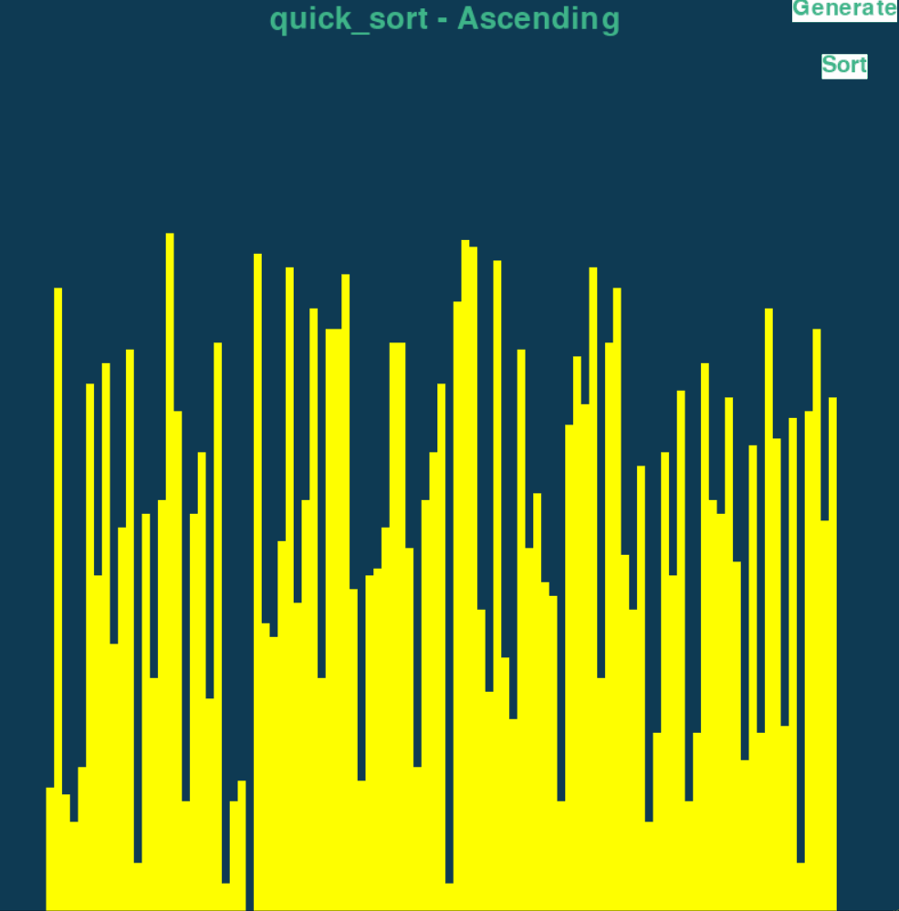

  

<h1 align="center">Sorting Algorithm Visualizer</h1>

  <em>The Sorting Algorithm Visualizer is a Python project designed to help users understand various sorting algorithms through interactive visualizations. This tool uses Pygame to visually represent sorting processes, allowing users to see how different algorithms handle data. This repository contains the sorting algorithms that I know of, and I plan to add many more in the future.</em>

# Table of Contents

- [Table of Contents](#table-of-contents)
  - [Overview](#overview)
  - [Sorting Algorithm Contents](#sorting-algorithm-contents)
  - [Selection Sort](#selection-sort)
    - [Selection Sort Visualizer Interface](#selection-sort-visualizer-interface)
  - [Insertion Sort](#insertion-sort)
    - [Insertion Sort Visualizer Interface](#insertion-sort-visualizer-interface)
  - [Bubble Sort](#bubble-sort)
    - [Bubble Sort Visualizer Interface](#bubble-sort-visualizer-interface)
  - [Merge Sort](#merge-sort)
    - [Merge Sort Visualizer Interface](#merge-sort-visualizer-interface)
  - [Quick Sort](#quick-sort)
    - [Quick Sort Visualizer Interface](#quick-sort-visualizer-interface)
- [Requirements/Steps to Run](#requirementssteps-to-run)
- [Contact](#contact)
  - 

## Overview

The Sorting Algorithm Visualizer uses Pygame to demonstrate the workings of various sorting algorithms interactively.

A sorting algorithm is used to rearrange a given array or list of elements according to a comparison operator on the elements. The comparison operator decides the new order of elements in the respective data structure.

## Sorting Algorithm Contents

- **Selection Sort**
- **Insertion Sort**
- **Bubble Sort**
- **Merge Sort**
- **Quick Sort**

## Selection Sort

**Concept:**  
Selection Sort works by repeatedly finding the minimum (or maximum) element from the unsorted portion of the list and moving it to the beginning (or end) of the sorted portion.

**Process:**  
- Start with the first element as the minimum.
- Compare it with the rest of the elements to find the true minimum.
- Swap the minimum element with the first element.
- Repeat the process for the remaining unsorted portion.

**Time Complexity:**  
- Worst-case: O(n²)
- Best-case: O(n²) (no improvement in best case)

**Space Complexity:**  
- O(1) (in-place sorting)

### Selection Sort Visualizer Interface

  

 

## Insertion Sort

**Concept:**  
Insertion Sort builds the sorted portion of the list one element at a time. It repeatedly picks the next element from the unsorted portion and inserts it into its correct position in the sorted portion.

**Process:**  
- Start with the second element and compare it to the first.
- Insert it into the correct position in the sorted portion.
- Repeat this for all remaining elements, each time inserting the element into the correct position within the already sorted portion.

**Time Complexity:**  
- Worst-case: O(n²) (when the list is sorted in reverse order)
- Best-case: O(n) (when the list is already sorted)

**Space Complexity:**  
- O(1) (in-place sorting)

### Insertion Sort Visualizer Interface

  

 

## Bubble Sort

**Concept:**  
Bubble Sort repeatedly steps through the list, compares adjacent elements, and swaps them if they are in the wrong order. The process is repeated until the list is sorted.

**Process:**  
- Compare each pair of adjacent elements.
- Swap them if they are in the wrong order.
- Repeat the process until no swaps are needed.

**Time Complexity:**  
- Worst-case: O(n²) (when the list is sorted in reverse order)
- Best-case: O(n) (when the list is already sorted)

**Space Complexity:**  
- O(1) (in-place sorting)

### Bubble Sort Visualizer Interface

  

 

## Merge Sort

**Concept:**  
Merge Sort is a divide-and-conquer algorithm that divides the list into halves, sorts each half, and then merges the sorted halves to produce a single sorted list.

**Process:**  
- Divide the list into two halves.
- Recursively sort each half.
- Merge the sorted halves to produce the final sorted list.

**Time Complexity:**  
- Worst-case: O(n log n)
- Best-case: O(n log n)

**Space Complexity:**  
- O(n) (requires additional space for merging)

### Merge Sort Visualizer Interface

  

 

## Quick Sort

**Concept:**  
Quick Sort is a divide-and-conquer algorithm that selects a 'pivot' element and partitions the list into elements less than and greater than the pivot. It then recursively sorts the partitions.

**Process:**  
- Choose a pivot element.
- Partition the list into elements less than and greater than the pivot.
- Recursively apply the same process to the partitions.

**Time Complexity:**  
- Worst-case: O(n²) (when the pivot is the smallest or largest element)
- Best-case: O(n log n)

**Space Complexity:**  
- O(log n) (due to recursion stack)

### Quick Sort Visualizer Interface

  

 

# Requirements/Steps to Run
- Install [Python](https://www.python.org/downloads/)
- Install [Pygame-ce](https://pyga.me/)
- Run `Algorithm_Visualizer (main).py`
  
 

# Contact

- **NoahXiren**
  - LinkedIn: [www.linkedin.com/in/noah-xiran-8445042ba](https://www.linkedin.com/in/noah-xiran-8445042ba)
  - Email: shivaheldzinnia85@gmail.com
- **project Link**
  - [Algorithm Visualizer](https://github.com/NoahXiren/Sorting-Algorithm-Visualizer)
  
  
## 

<h3>Thank You!</h3>

